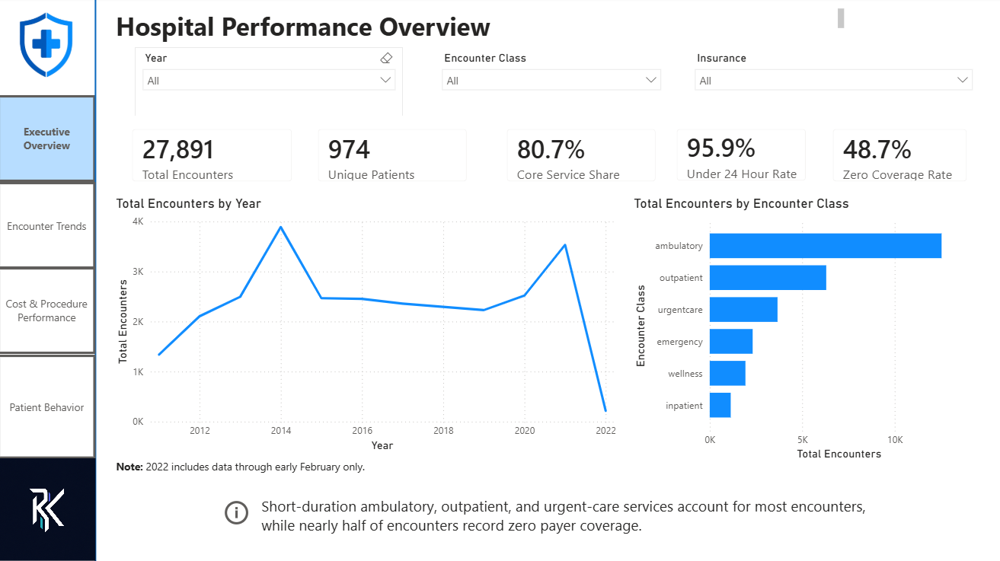
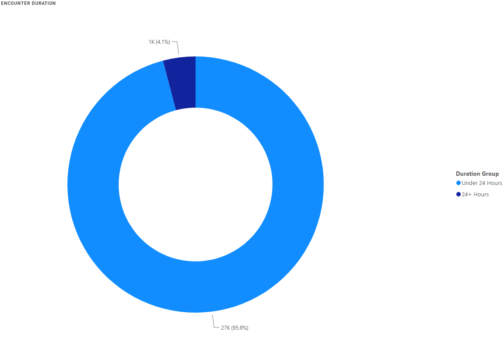
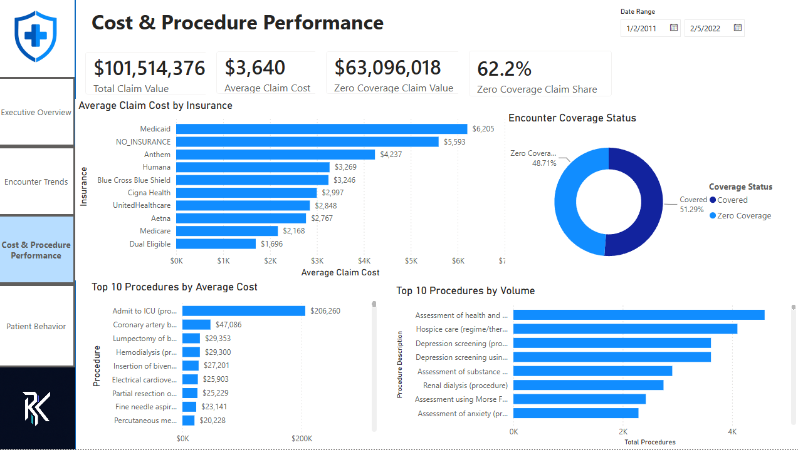
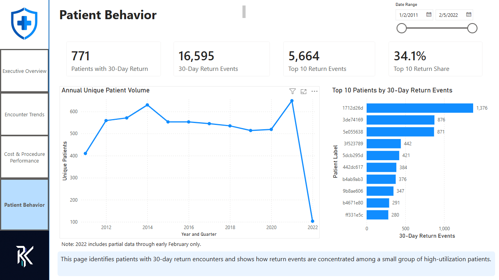
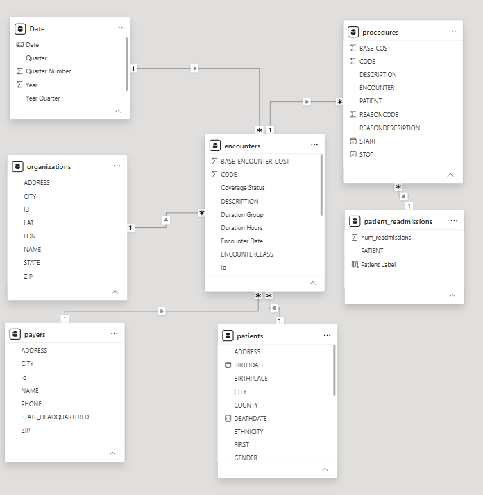

# Massachusetts General Hospital Operations & Financial Performance Analysis


---

## Project Overview

Healthcare organizations must balance patient demand, operational efficiency, and financial sustainability while maintaining quality care.

This project analyzes synthetic healthcare data modeled after Massachusetts General Hospital to evaluate patient utilization, encounter activity, payer coverage, procedure costs, and repeat patient behavior.

Using MySQL and Power BI, I developed an analytics solution that helps hospital operations and finance leaders identify utilization trends, financial risk, and opportunities for operational improvement.

---

## Dashboard Preview
[View Interactive Power BI Dashboard](https://app.powerbi.com/view?r=eyJrIjoiZjNjZGQ3ZmQtNmM5MS00Zjg1LTliYmMtNTM3YzczNDJlOTY2IiwidCI6ImYyNTUyZTQ3LTkzMTYtNDBmYy05ZjAwLTdmODU4MmMxYTFkMyIsImMiOjZ9)

[Download Power BI File](dashboards/hospital_performance_report.pbix)


### Executive Overview



### Encounter Trends



### Cost & Procedure Performance



### Patient Behavior



---

## Business Problem

Hospital leadership requires visibility into:

- Patient demand and utilization trends
- Encounter volume across service lines
- Payer coverage performance
- Procedure costs and financial exposure
- Repeat utilization behavior

Without centralized reporting, operational and financial risks may remain hidden, limiting the organization's ability to make proactive decisions.

---

## Business Questions

### Operations

- How has encounter volume changed over time?
- Which encounter classes generate the highest demand?
- What percentage of encounters are completed within 24 hours?

### Finance

- How much claim value is associated with zero payer coverage?
- Which procedures generate the highest average costs?
- Where is the organization most exposed to reimbursement risk?

### Patient Utilization

- Which patients account for the highest volume of 30-day return activity?
- How concentrated is repeat utilization across the patient population?

---

## Executive Summary

### Key Metrics

| Metric | Value |
|----------|----------:|
| Total Encounters | 27,891 |
| Unique Patients | 974 |
| Zero Coverage Encounters | 13,586 |
| Zero Coverage Claim Value | $63.1M |
| Patients With Return Activity | 771 |
| Total 30-Day Return Events | 16,595 |

### Key Findings

#### 1. Short-Duration Care Drives Hospital Activity

- Ambulatory, outpatient, and urgent-care services represented 80.7% of all encounters.
- 95.9% of encounters were completed within 24 hours.

**Business Impact:** Operational efficiency improvements in these settings would affect the majority of hospital activity.

---

#### 2. Zero-Coverage Encounters Create Significant Financial Risk

- 48.7% of encounters had zero payer coverage.
- These encounters represented $63.1M in claim value.
- Zero-coverage encounters accounted for 62.2% of total claim value.

**Business Impact:** Revenue-cycle teams should prioritize eligibility verification and coverage validation workflows.

---

#### 3. Repeat Utilization Is Highly Concentrated

- 771 patients generated qualifying 30-day return encounters.
- 16,595 return events were identified.
- The top 10 patients accounted for 34.1% of all return activity.

**Business Impact:** Targeted care-management programs may reduce repeat utilization more effectively than broad interventions.

---

## Data Architecture

### Data Model



### Tables Used

| Table | Description |
|---------|---------|
| encounters | Encounter activity, claim costs, payer coverage, encounter class |
| patients | Demographic and geographic patient information |
| payers | Insurance payer information |
| procedures | Procedure descriptions and base costs |
| organizations | Hospital organization information |
| patient_readmissions | Derived SQL output containing 30-day return activity |

### Entity Relationships

```text
patients[Id]          → encounters[PATIENT]
payers[Id]            → encounters[PAYER]
organizations[Id]     → encounters[ORGANIZATION]
encounters[Id]        → procedures[ENCOUNTER]
patients[Id]          → patient_readmissions[PATIENT]
```

## Analytical Insights

### Operational Utilization Analysis

- Evaluated encounter volume trends over time
- Analyzed service-line utilization patterns
- Measured encounter duration distribution
- Identified high-demand operational areas

### Financial Exposure Analysis

- Measured payer coverage performance
- Quantified zero-coverage financial exposure
- Compared high-volume versus high-cost procedures
- Evaluated claim-value concentration

### Patient Behavior Analysis

- Identified 30-day return patterns
- Measured repeat utilization concentration
- Ranked patients by return activity
- Evaluated opportunities for targeted intervention

---

## Recommendations

### 1. Improve Throughput in High-Volume Care Settings

Focus operational improvement efforts on ambulatory, outpatient, and urgent-care workflows where most encounters occur.

### 2. Strengthen Revenue-Cycle Controls

Implement earlier payer eligibility verification and proactively review high-value encounters lacking coverage.

### 3. Separate Capacity Planning from Cost Monitoring

Use procedure volume to guide staffing decisions and procedure cost metrics to evaluate financial exposure.

### 4. Target High-Utilization Patients

Develop care-management workflows for patients demonstrating frequent return activity.

---

## Technical Skills Demonstrated

### SQL

- Multi-table joins
- Data aggregation
- Common Table Expressions (CTEs)
- Window Functions
- LEAD()
- CASE Statements
- TIMESTAMPDIFF()
- Percentage Calculations

### Power BI

- Data Modeling
- KPI Development
- Dashboard Design
- Drill-Through Analysis
- Executive Reporting

### Power Query

- Data Transformation
- Data Cleansing
- Calculated Columns

---

## Repository Structure

```text
hospital-performance-analysis/
│
├── README.md
│
├── data/
│   ├── encounters.csv
│   ├── patients.csv
│   ├── payers.csv
│   ├── procedures.csv
│   ├── organizations.csv
│   └── patient_readmissions.csv
│
├── sql/
│   └── hospital_analytics_queries.sql
│
├── dashboard/
│   └── hospital_performance_dashboard.pbix
│
└── images/
    ├── executive_overview.png
    ├── encounter_trends.png
    ├── cost_procedure_performance.png
    ├── patient_behavior.png
    └── data_model.png
```

---

## Tools Used

- MySQL
- Power BI
- Power Query
- CSV

---

## Caveats

- Data was generated using Synthea and does not represent actual Massachusetts General Hospital patient records.
- Results should be interpreted as an analytical case study rather than a clinical performance evaluation.
- The 30-day return metric reflects project-defined business logic and is not equivalent to CMS readmission methodology.
- Claim costs represent recorded claim values and do not reflect final reimbursement outcomes.

---

## Data Source

The dataset was provided through the Maven Analytics Hospital Analytics project and generated using Synthea, an open-source synthetic patient generator.

**Reference:** Walonoski, J., Kramer, M., Nichols, J., et al. (2018). *Synthea: An approach, method, and software mechanism for generating synthetic patients and synthetic electronic health records.* Journal of the American Medical Informatics Association, 25(3), 230–238. 
